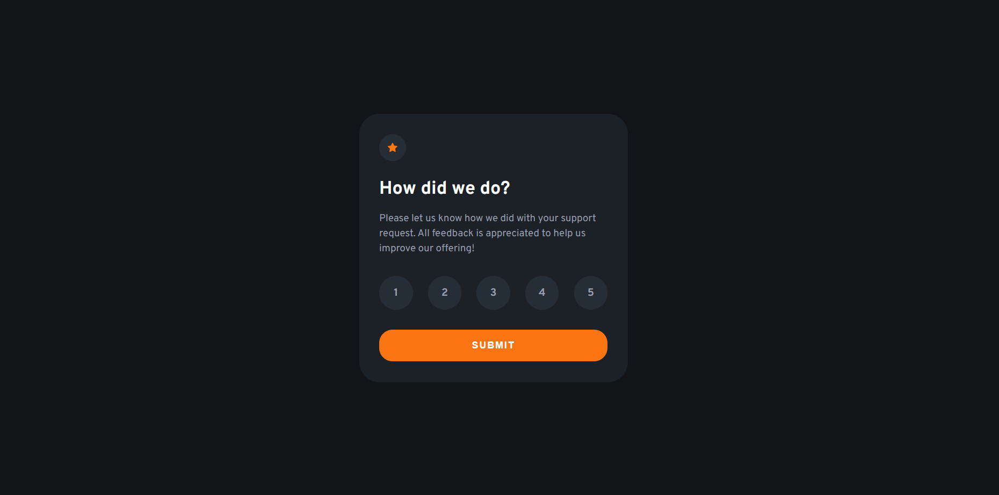

# Frontend Mentor - Interactive rating component solution

This is a solution to the [Interactive rating component challenge on Frontend Mentor](https://www.frontendmentor.io/challenges/interactive-rating-component-koxpeBUmI). 

## Table of contents

- [Overview](#overview)
  - [Screenshot](#screenshot)
  - [Links](#links)
- [My process](#my-process)
  - [Built with](#built-with)
  - [What I learned](#what-i-learned)
  - [Useful resources](#useful-resources)
- [Author](#author)


## Overview

### Screenshot



### Links

- Solution URL: [https://jefferh30.github.io/Interactive-Rating-Component/](https://jefferh30.github.io/Interactive-Rating-Component/)
- Live Site URL: [https://jefferh30.github.io/Interactive-Rating-Component/](https://jefferh30.github.io/Interactive-Rating-Component/)

## My process

### Built with

- Semantic HTML5 markup
- CSS custom properties
- Flexbox
- Mobile-first workflow
- CSS hover states
- Simple JavaScript

### What I learned

- Practiced the use of Flexbox and semantic HTML.
- Got more comfortable with DOM JavaScript
- Learned to add and remove a CSS class in order to change the style of elements using JavaScript.
- Learned to pass the id of an element when using the onClick event.
- Getting used to using git commands to push from local environment to GitHub.

```html
<main>Inserted the Rating component here</main>
<footer>Inserted attribution here</footer>
```
```css
main{
    display: flex;
    justify-content: center;
    align-items: center;
    min-height: 100vh;
}
```

```js
//adds class to element to show that it is selected
    if (rateNumber != ""){
        //removes class from all elements to handle cases where more than one is selected
        arrayRating.forEach(element => document.getElementById(element).classList.remove("rating-active"));
        document.getElementById(rating).classList.add("rating-active");
    }
```


### Useful resources

- [Video for deploying to Github pages](https://www.youtube.com/watch?v=XGcuxuhV-Jg&t=453s) - This helped me in deploying from the local environment to Github pages.

## Author

- Website - [Jefferson Huera](https://www.neurochispas.com)
